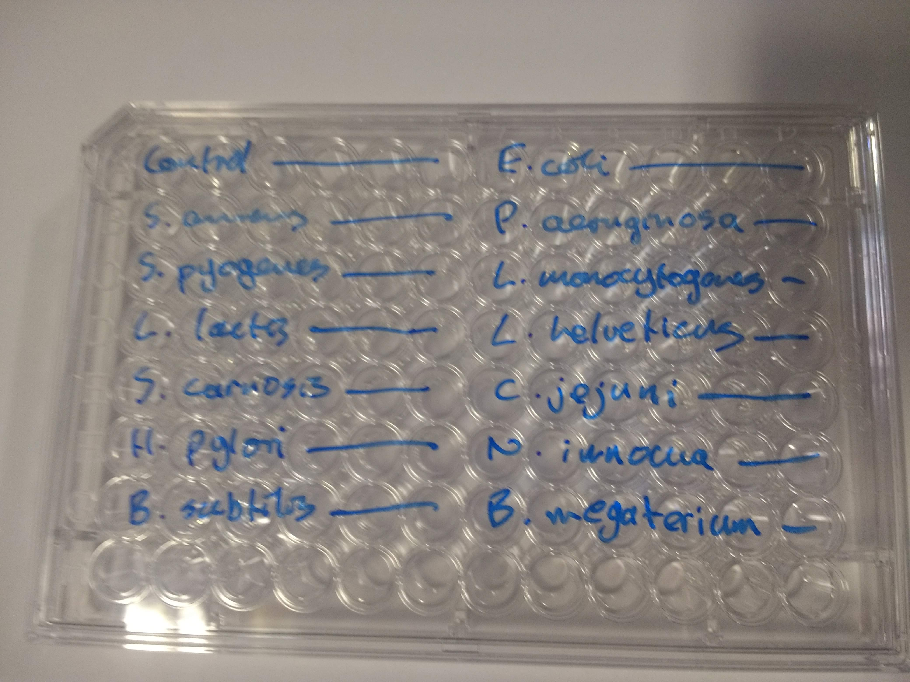

#Introduction

I've recently been using a microtitre plate reader for some experiments. These useful devices take a microtitre plate (which has multiple wells in which to set up loads of experiments in parallel) and read off some property of each such as turbidity or fluorescence.


From Wikimedia Commons.

I was not entirely satisfied with doing analysis using the plate reader manufacturer's software, and I was a bit disappointed with the export options, which seem to encourage output to Excel. Is was, however, possible to get a .csv file (via Excel) and thence import to R. Alas, the format of this meant that no metadata (e.g. make of machine, wavelength of light, duration of measurement) was carried across. This is upsetting. However, I'll describe here the process of loading the data into R and visualising it, on the basis that lots of plate readers probably output similar formats, and that people might want to know how to get their data into R. 

I will make use of these libraries:

```{r}
library(magrittr)
library(reshape2)
library(dplyr)
library(ggplot2)
library(viridis)
```

Rather than use a real life example, I'm going to make a .csv file similar to the one that comes from the machine for this. Do skip this section if you're not interested in the the details of how the data was simulated. You can find the .csv file [here](plate_eg.csv). And skip to the bit about loading it in [here](#reading).

#Simulating plate reader ouput

This happens in two stages, first simulating the data and then saving it as a .csv file. 

##Simulation

I'm going to imagine that the first 6 wells from top left to bottom right are controls with a value of zero. I'm then going to simulate blocks of 6 wells with a random mean between 0.5 and 1.5 drawn from a uniform distribution (same same mean for all 6 wells), and a standard deviation of 0.2, simulating some random variability. I'm imagining each block represents some characteristic of a different species of bacteria (see photo below). The last 12 wells, I'll leave empty. This code is a bit inelegant, but much more complex layouts are possible. I know. I've seen them!

```{r}
set.seed(1)

zero_block<-c(0,0,0,0,0,0) #"controls"

plate_eg<-zero_block #initialise plate_eg, a variable to hold my example

for(i in 2:14){
  plate_eg=c(plate_eg, rnorm(6,runif(1,0.5,1.5),0.2)) #simulate well values
}

plate_eg<-c(plate_eg,zero_block,zero_block) #add some empty wells

dim(plate_eg) <- c(12, 8) #redimension to be the shape of a 12 x 8 96 well plate

plate_eg<-t(plate_eg) #transpose

plate_eg<-as.data.frame(plate_eg) #convert to a data frame

row.names(plate_eg)<-LETTERS[seq(1,8)] #name the rows as they would be on the plate (A to H)

```



##Write to disk

Saving to disk is done with a simple line of code.

```{r}
write.csv(plate_eg,"plate_eg.csv")
```

<a id="reading"></a>

#Reading the .csv file 

OK. This is where one would start if you just had a file from your plate reader (which is the real point of this note!).

##Read the file

The following code will read in the data. It then converts it into "long format" ([have a look at this](http://www.cookbook-r.com/Manipulating_data/Converting_data_between_wide_and_long_format/#reshape2)), in order to do this (making use of the row names as a variable) it seems it must first be made into a matrix. I finally sort by row, then column.

```{r}
plate<-read.csv("plate_eg.csv",row.names = 1) %>%
    as.matrix() %>%
    melt(varnames=c("RowID","ColID")) %>%
    arrange(RowID,ColID)

head(plate,8)
```

##Do a quick plot

I can then do a quick visualisation of the plate data. R and ggplot2 allow me much more flexibility in the way I do this than the plate reader software.

```{r}

ggplot(plate,aes(x=ColID,y=RowID,fill=value,label=signif(value,2)))+
    labs(fill=expression(OD[600]),x="column",y="row")+
    geom_tile(colour = "white")+
    scale_y_discrete(limits = rev(levels(plate$RowID)))+
    scale_fill_viridis()+
    geom_text(colour = "white")

```

However, this plot lacks any information about what's actually in the plate. We want to be able to draw some conclusions based on our experiment!

##Save a list of wells

I'm going to save a list of all the wells to a .csv file

```{r}

write.csv(data.frame(RowID=plate$RowID,ColID=plate$ColID,SampleID=NA),"well_list.csv",row.names = FALSE)

```

This can then be loaded into a spreadsheet to specify what's in each well on the plate. This is one of the times where it's easier to drop out of R. And while this may seem long-winded, if I'm doing the same plate assay repeatedly (say 20 times), I can re-use my annotation file. This will save a lot of time compared to doing everything in a spreadsheet.

##Load annotated list of wells

The [annotated list of wells](well_list_annotated.csv) is loaded in like so:

```{r}

well_list_annotated<-read.csv("well_list_annotated.csv")

head(well_list_annotated,8)

```

I have deliberately not labelled the last 12 wells (which I'm imagining were empty).

##Label the data using the annotations

Next, I can make use of a join (an idea rooted in databases) to match up the wells to the annotations (sample IDs). Then, a select statement drops all of the row and column IDs from the resulting data frame, leaving me with a set of meaningfully labelled data. (The warning here is not a problem).

```{r}
plate_annotated<-right_join(plate,well_list_annotated) %>%
  select(SampleID,value)

head(plate_annotated,8)
```

#Analyse data

Now I have my data nicely formatted, it's much easier to analyse and visualise.

##Summarise the data

I can produce a summary table, with whatever statistics I want to calculate. In this case, mean, standard error and number of samples.

```{r}

plate_annotated$SampleID<-factor(plate_annotated$SampleID, levels=unique(plate_annotated$SampleID)) #this line preserves the order of the data when it is summarised, it would otherwise be sorted alphbetically

plate_annotated %>%
  group_by(SampleID) %>%
  summarise(mean=mean(value),"standard error"=sd(value)/sqrt(n()),n=n())

```

##Visually compare groups

Lastly, I can plot the data grouped for each sample in order to visually compare values.

```{r}
ggplot(plate_annotated,aes(x=SampleID,y=value,colour=SampleID)) +
  stat_summary(fun.y = "mean", geom = "point", colour="black") +
  stat_summary(fun.data = mean_se, geom = "errorbar") +
  geom_jitter() +
  theme(axis.text.x = element_text(angle = 90, hjust = 1, face = "italic")) + 
  theme(legend.position="none")
```

#How has this helped?

This may seem like a lot of effort, and it might well be for a single plate / single experiment. But if one is running lots of plates, I think time can be saved. Then there's the added bonus that all analysis is explicitly described and therefore repeatable, and not hidden in proprietary code. Copy-paste and typing errors are limited. And one has supreme flexibility in what analysis, visualisations and statistical tests are carried out. Because the next thing one would want to do would likely be some statistics.

See my [website](https://sites.google.com/view/robert-turner) for more examples. Contact me on bob dot turner dot uk at gmail dot com with comments or questions.